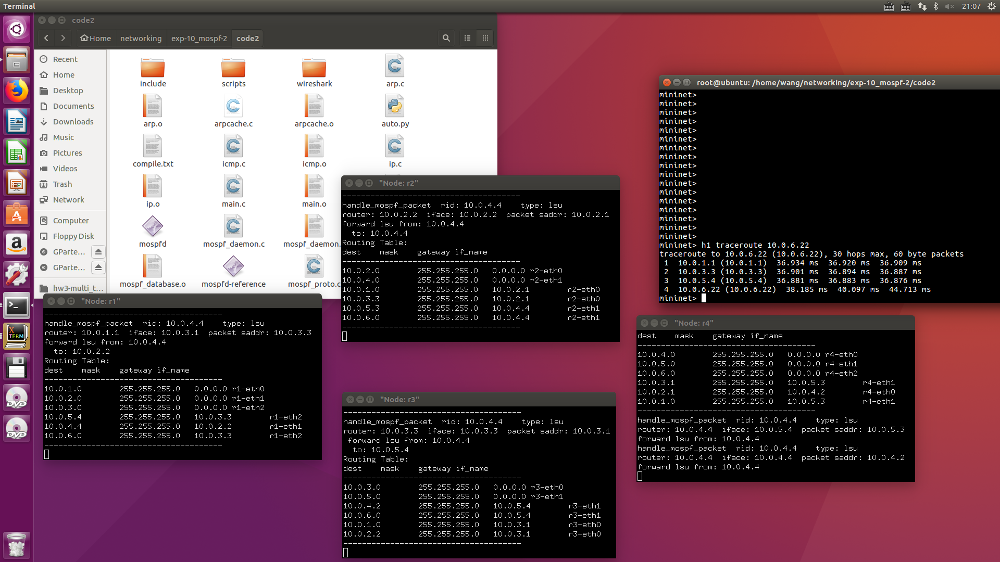
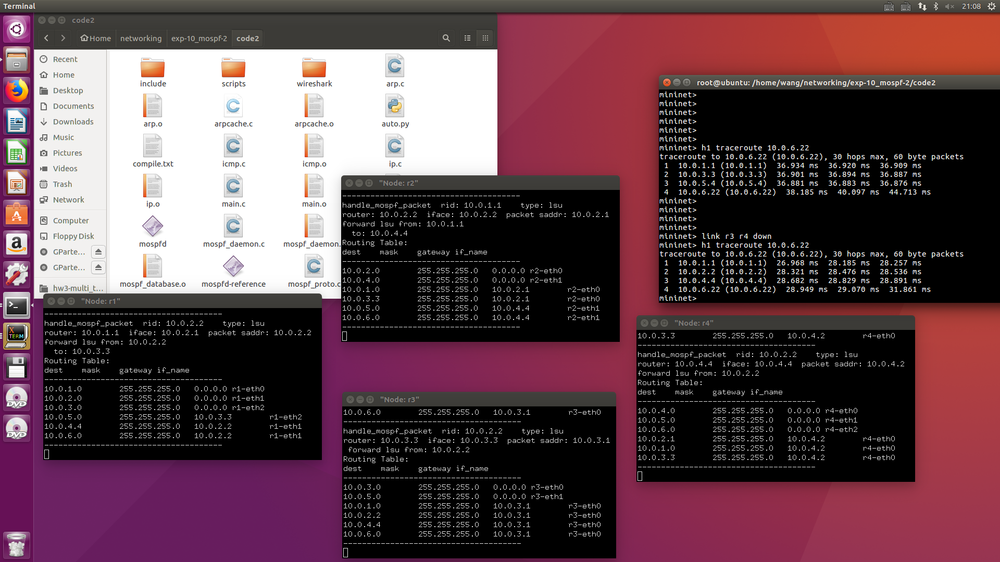

# 实验报告

姓名：王苑铮 学号：2015K8009922002
- - -
## 1.实验题目：  网络路由实验二
- - -
## 2.实验内容：
* 利用dijkstra算法，计算网络路由的最短路径，添加路由表项

- - - 
## 3.实验过程
#### 1.上次lsu的遗留问题
上次的实验中，每个节点的链路状态数据库(db)里的每个db_entry(对应网络中一个路由器)下是没有使用默认网关的。我上次的做法是h1 h2也发送mospf，每个节点发出的lsu中的lsa是该节点所有用hello确认存在的邻居。可能是这种设计导致网络中传输的包太多，只要我把全部节点都运行mospf，虚拟机显示时就会出现很严重的掉帧问题，并且还经常死机。另外还经常出现明明每个节点都在运行mospf并且所有连接都没有被down掉，但是总是有节点发生timeout。而且ping也不稳定，有时候能ping通有时候不通。以上问题都怀疑是因为旧的设计不合理，网络中包太多+虚拟机性能不够，导致丢包。
于是后来更改的lsa的设计，h节点不发lsa。r节点发出的lsu包中，有等于其iface个数(也即gw==0的路由表项个数)的lsa。如果一个iface下有nbr，则lsa的gw为nbr_ip，否则gw为0(默认网关)。
#### 2.如何更新路由表项：
dijkstra算法不太好用语言描述，而且各种课上都反复学过，这里就先不写了。
执行dijkstra算法的同时，可以把每次新加入的节点依次放在一个数组ordered_nodes[]中。算法执行完后，数组按序号递增，离当前路由器的cost也越来越大。按递增顺序遍历此数组，每个节点下的邻居的subnet若不在路由表里，则在路由表中添加一个该iface，gw<->subnet，mask的映射
#### 3.路由表的老化
没有专门设计路由表的老化操作。实验中的路由表是用链表做的，删掉链表的复杂度是线性的。所以每次运行完dijkstra算法之后，更新路由表前，把所有gw!=0的路由表项(dijkstra算法动态产生的表项都删掉)，再把此次新计算出的所有表项都加入路由表中，就自然完成了老化-更新的操作
这样直接删掉所有旧的表项，可能比挨个检查每个节点是否需要去掉更省时间。
- - -
## 4.实验结果
#### 4.1完整拓扑
```mermaid
graph LR
r1((r1))
r2((r2))
r3((r3))
r4((r4))
h1 --- r1
r1 --- r2
r1 --- r3
r2 --- r4
r3 --- r4
r4 --- h2
```
#### 运行结果

#### 4.2 link r3 r4 down
```mermaid
graph LR
r1((r1))
r2((r2))
r3((r3))
r4((r4))
h1 --- r1
r1 --- r2
r1 --- r3
r2 --- r4
r3 -.down .- r4
r4 --- h2
```
#### 运行结果

- - -
## 5.结果分析
1.down掉r3 r4的连接后，各个路由器的路由表更新了，并且新的路由表下，h1依然可以连接到h2.说明ospf机制可以应对链路断开的情况
2.让r3停止运行mospf，也可得到和link r3 r4 down一样的traceroute路径。说明ospf机制可以应对路由器消失的情况
3.link r3 r4 up重新连接起r3，r4，traceroute变回最开始的路径。说明ospf确实能做到实时更新，总是按按当前最短路径生成路由表
**结论：** ospf机制可以可靠的、自学习的、最短路径的、实时应对网络变化的生成网络路由表