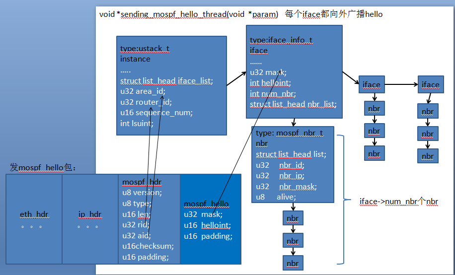
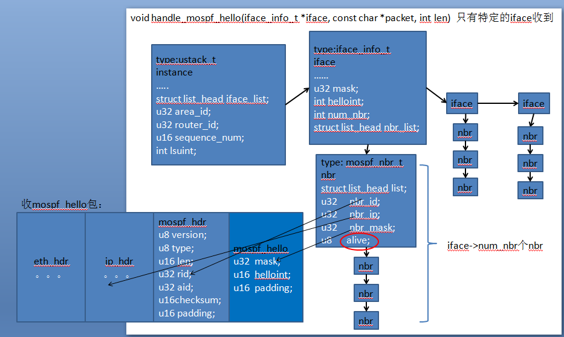
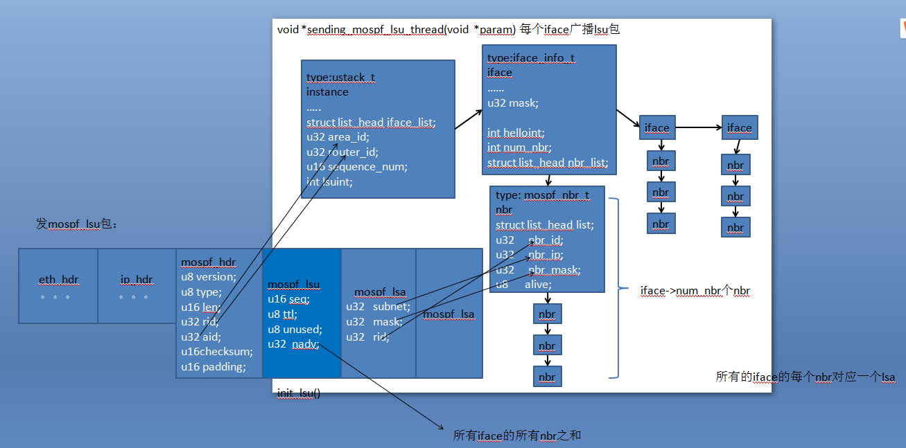
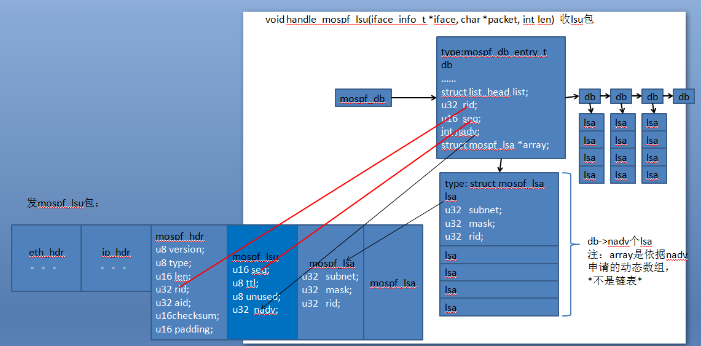
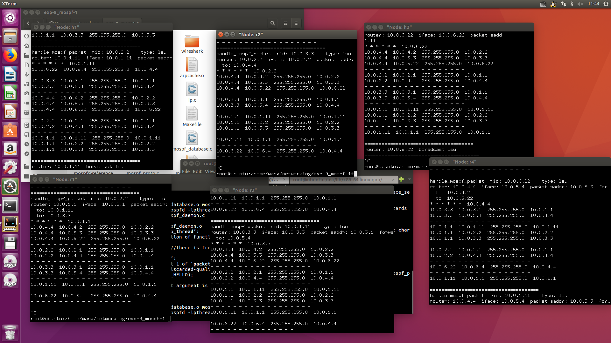

# 实验报告

姓名：王苑铮 学号：2015K8009922002
- - -
## 1.实验题目：  网络路由实验一
- - -
## 2.实验内容：
* 发送、接收mostf_hello
* 发送、接收mostf_lsu
* 邻居老化

- - - 
## 3.实验过程
#### 节点维护的各主要数据结构的意义：
ustack_t instance:标识了一个节点的各种基本信息，用链表串起节点的所有iface
iface_info_t *iface:转发端口的信息，每iface用链表串起nbr
mospf_nbr_t *nbr:一个邻居节点。iface下的nbr链表代表一个iface的所有邻居节点
mospf_db_entry *db:一个mospf数据库表项。所有db连起来的链表构成了一个节点认为的的网络拓扑结构。一个db项代表网络中一个节点。db下面用链表串起lsa，这个lsa链表代表一个节点的所有邻居，每个lsa为一个邻居
#### 本地数据结构与收发包的关系：
**send_hello**

**handle_hello**

**send_lsu**

**handle_lsu**

代码略，见提交的代码包
- - -
## 4.实验结果
#### 拓扑结构
```mermaid
graph LR
r1((r1))
r2((r2))
r3((r3))
r4((r4))
h1 --- r1
r1 --- r2
r1 --- r3
r2 --- r4
r3 --- r4
r4 --- h2
```
#### 运行结果
r1,r2,r3,r4以及h1,h2都运行了./mospfd，以下为表项不再发生变化时的结果。

- - -
## 5.结果分析
每个表项代表网络中的一个节点。每个节点上都显示了五个mostf_database表项，即为网络中除了自己之外的节点。
可以明显看出，h1有一个邻居r1;r1有三个邻居h1,r2,r3;r2有两个邻居r1,r4. h2，r3，r4同理。并且不同节点打印的数据库中，同一个节点对应的表项内容是一致的，说明mospf成功让每一个节点都正确知道了路由拓扑结构